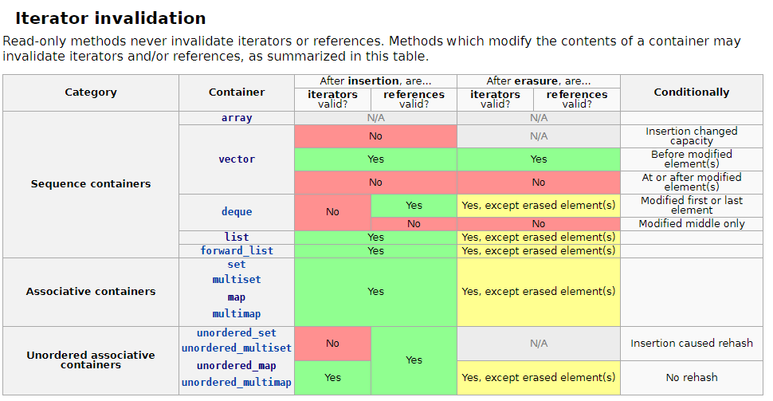

# Ordered_Map

[GitHub](https://github.com/DevStppp/ordered_map)

using std::unordered_map, std::list

: Hash Map인 [std::unordered_map](https://en.cppreference.com/w/cpp/container/unordered_map)을 이용하여 O(1) (hash의 분포도에 따라 다를수 있다. 최악O(n))로 탐색하고 linked list인 [std::list](https://en.cppreference.com/w/cpp/container/list)를 이용하여 insert 순서를 유지시키는 맵 자료구조

**목차**

# 기본 구조

## [Iterator Invalidation](https://en.cppreference.com/w/cpp/container)



- std::list의 iterator 는 삽입/삭제시에 유효하다(해당 element가 지워지지 않은 이상)

: list는 vector와 다르게 비연속 메모리이기 때문에 iterator가 node ptr로 이루어져 있기때문에 다른 element가 삽입/삭제되어도 iterator가 유효하다.

- std::list::iterator의 성질을 std::unordered_map에 list::iterator 삽입하여 search를 o(1)에 가능하게 하자.

## Container's Data

- 멤버 변수

```cpp
//순서를 유지하기 위한 list 
//외부에서 iterator 접근시 std::map과 동일하게 접근 할수 있도록 key/value pair로 data삽입
std::list<std::pair<const key, value>> m_list;

//search 를 위한 hash map
//key, 위의 list의 iterator(node's ptr)를 가지고 있다.
//공간 복잡도를 줄이기 위한 list::iterator 사용
std::unordered_map<const Key, list<...>::iterator> m_map;
```

- Insert 과정

```cpp
{
		...
    //value = std::pair<const key, value>
		iterator inserted = m_list.insert(pos, std::move(value));
    //map에 위에서 삽입된 list's iterator(node' ptr)을 value로 사용한다
    auto result = m_map.emplace(key, inserted);
		....
 }
```


<aside>
💡 데이터 삽입 과정 요약 😱

</aside>

1. pair<key,value>를  data로 사용하는 list에 삽입한다.
2. 삽입된 node's pointer(list::iterator)를 가져온다
3. 위에서 가져온 list::iterator를 이용하여 pair<key, list::iterator> 쌍으로 map에 삽입한다 

# Complexity

## 시간복잡도

: [std::unordered_map](https://en.cppreference.com/w/cpp/container/unordered_map)을 이용한 Hash_map을 사용하기 때문에 탐색시 O(1)의 시간 복잡도를 가진다.(최악일때는 O(n))

## 공간 복잡도

: 삽입된 순서를 유지하기 위해서 [std::list](https://en.cppreference.com/w/cpp/container/list)를 사용하기 때문에 unordered_map에서 추가 데이터 공간이 필요하다.

```cpp
std::list<std::pair<const Key, Value>>;
std::unordered_map<Key, iterator, Hash>;
```

- list<const key, value>
- unordered_map<key, list::iterator>

위와 같이 되어 있기때문에 Node하나를 구성하는데 추가로 

 + key (key 타입 사이즈)

 + list::iterator ( pointer 타입 사이즈)

가 추가로 필요하다. (기존 unordered_map 에 추가로 필요한 공간)

key 가 int8_t이고 x64플랫폼이라고 가정하면

1Byte(key) + 8byte(iterator) = 9Byte가 Value 하나마다 더 필요하다.

# Functions

## Key를 이용한 탐색  및 삭제

- Key를 이용한 탐색 함수들 : at(key), operator[](key), find(key)
- Key를 이용한 삭제 함수들 : erase(key)

## Iterator를 이용한 순차 접근

- begin(), end(), rbegin()....
- Iterator를 이용한 삽입 : insert(iterator..), emplace(iterator...)
- Iterator를 이용한 삭제: erase(iterator)

# Sample Code

추가 Sample Code는 Testcase들 참고

```cpp
#include "ordered_map.h"
#include <string>
#include <iostream>

namespace std {
    std::ostream& operator<<(std::ostream& os, const std::pair<const int32_t, std::string> pair)
    {
        os << "{ " << pair.first << ", " << pair.second << " }, ";
        return os;
    }
}

int main(int argc, char* argv[])
{
	using ordered_map = stppp::ordered_map<int32_t, std::string>;

	ordered_map map = {{1, "1"},
                       {99, "99"},
                       {3, "3"},
                       {2, "2"}};

	for (auto iter : map)
        std::cout << iter;
    std::cout << std::endl;

	auto findRet = map.find(99);
    if (findRet != map.end())
        std::cout << "Find Node " << *findRet << std::endl;

    std::cout << "map[99] = " << map[99] << std::endl;
    //add {9999,""}
    std::cout << "map[9999] = " << map[9999] << std::endl;

	map.emplace_back(333, "333");
    
    for (auto iter : map)
        std::cout << iter;
    std::cout << std::endl;

    auto duplicatedKey = map.emplace_front(1, "111");
    if (duplicatedKey.second == false)
        std::cout << "add FAIL (duplicatedKey)" << std::endl;

	return 0;
}
```

# Build TestCode

: [CMake](https://cmake.org/)와 Visual Studio 2019(windows), make(linux) 이용한 빌드 예제

```cpp
//Visual Studio 2019 for windows x64
mkdir build
cd build
cmake -S ../ -G "Visual Studio 16 2019" -A x64
//Visual Studio 2019로 odered_map솔루션으로 빌드하면 됨.

//ubuntu
mkdir build
cd build
cmake -S ../
//build using makefile
make
```

## CMake Option

**FIFO_MAP_TEST_OPTION (Default = OFF)**

[Nlohmann::fifo_map](https://github.com/nlohmann/fifo_map)의 Crash 발생 하는 testcase도 넣어 놔서 기본적으로 crash testcase는 off시켜놧다. 

해당 testcase열기 위해서는 ON 시키면 된다.

(-D**FIFO_MAP_TEST_OPTION**=ON)

VSC

```json
//setting.json
"cmake.configureSettings": {"FIFO_MAP_TEST_OPTION" : true}
```

# Clang-Format

Version 10 기준으로 작성 [Clang 10 Style Option](https://releases.llvm.org/10.0.0/tools/clang/docs/ClangFormatStyleOptions.html)

[JSON for Modern C++](https://github.com/nlohmann/json)의 .clang-formant을 기초로 해서 Clang10에 맞게 수정 및 필요한 부분만 이용

VSC settion.json

```json
{
//설치 경로
"C_Cpp.clang_format_path": "/usr/bin/clang-format",
"C_Cpp.clang_format_style": "file",
....
}
```

# ordered_map 만든 이유

: 다른 프로젝트를 진행하면서 순서가 유지되는 맵 이 필요했다.

처음에는 [Json for mordern c++](https://github.com/nlohmann/json) 로 유명한 nlohmann에 있는 [Nlohmann::fifo_map](https://github.com/nlohmann/fifo_map)으로 timestamp (uint++)를 이용해서 정렬된 형태의 map을 제공해서 fifo_map을 쓸려고 했다.

## [Nlohmann::fifo_map](https://github.com/nlohmann/fifo_map) 미사용 이유

- 기본적으로 std::map을 사용하는 자료 구조여서 탐색시에 O(logN)에 걸린다. 크게 문제 없지만 hashed map으로 탐색시 O(1)로 하고 싶었다.
- 내부에서 key값을 pointer로 관리하는데 (아마도 공간복잡도 줄일려고 하는거 같음.) 해당 pointer들로 인한 Crash가 발생한다.
- multi thread 환경에서 동기화 되지 않은 crash가 발생한다.

## Swap 시 Crash

 :  [Nlohmann::fifo_map](https://github.com/nlohmann/fifo_map) 's Swap Crash

- Test code (fifomap_swap_test.h)

```cpp
auto fFifo_Map_Swap = []() {
    using fifo_map = nlohmann::fifo_map<int32_t, std::string>;

    fifo_map swapped_map;
    //scope for delete org_map
    {
        fifo_map org_map = {{1, "1"}, {2, "2"}, {3, "3"}};
        REQUIRE(swapped_map.empty());
        REQUIRE_FALSE(org_map.empty());

        REQUIRE_NOTHROW(org_map.swap(swapped_map));

        REQUIRE_FALSE(swapped_map.empty());
        REQUIRE(org_map.empty());
    }
    //scope for delete org_map
    REQUIRE(swapped_map.size() == 3);
    REQUIRE_NOTHROW(swapped_map.emplace(1, "222"));
    REQUIRE(swapped_map.size() == 4);
};
```

- Crash


내부에서 관리하는 Key's pointer  때문에 Crash가 발생한다.

## Multi Thread 동기화 문제

:  [Nlohmann::fifo_map](https://github.com/nlohmann/fifo_map) 's Multi thread Sync

- testcase (fifomap_multi_thread_test.h)

```cpp
auto fFifoMapMutiThreadSyncTest = []() {
    using fifo_map = nlohmann::fifo_map<int32_t, int32_t>;
    std::size_t spin_count = 3000;
    fifo_map map;

    std::thread producer([&]() {
        while (spin_count)
        {
            if (true == map.emplace(1, 1).second)
                spin_count--;
        }
    });

    std::thread consumer([&]() {
        while (spin_count)
        {
            if (map.find(1) != map.end())
                map.erase(1);
        }
    });

    if (producer.joinable())
        producer.join();
    if (consumer.joinable())
        consumer.join();
};
```

- Crash


삽입/삭제시에 동기화 되지 않아 Crash 발생한다.

## ordered_map's multi thread, swap

: 위의 문제점들을 고려하여 작업 하여서 테스트시에 정상 동작한다.

testcase : swap(swap_test.h, multi_thread_test.h)

